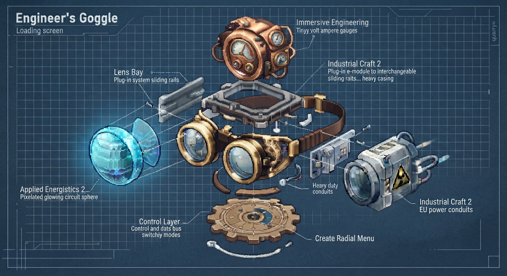

# create:yogglez



A central, modular goggle framework for Minecraft modpacks — built on top of the
Create **Engineer's Goggles**.

Instead of carrying a separate handheld analyzer for every mod, you upgrade the
engineer's goggles with swappable **lenses**. The goggles stay a physical tool
in your hand, but take over UI and information display exclusively.

## Core idea

- **Create integration as the foundation** — the Engineer's Goggles are extended
  with a modular lens system.
- **Pure analysis upgrade** — the goggles only display information. Physical
  tools (e.g. wrenches) stay in your hand for manual interaction.
- **Developer API for modpacks** — pack authors can integrate third-party
  analysis tools (e.g. via JSON/KubeJS) as goggle lenses.
- **Physical item, not a client-side overlay** — the goggles are a real,
  server-side item (craft, hold, wear, trade); lenses live in the item data.
  Client-side-only approaches (e.g. Create: Cyber Goggles) miss the vision.
  See [`mod-design/abgrenzung_cyber_goggles.md`](mod-design/abgrenzung_cyber_goggles.md).

## Example lenses (handheld-analyzer replacements)

| Mod                   | Replaces              | Shows                   |
| --------------------- | --------------------- | ----------------------- |
| Applied Energistics 2 | Network Tool          | Networks & channels     |
| Immersive Engineering | Engineer's Multimeter | Wiring & machine values |
| Industrial Craft 2    | Scanner / Tricorder   | Machine status & energy |

## Controls

- **Quick cycle** — cycle through the active lenses sequentially with a key press.
- **Radial menu** — hold a key to open a Create-style gear menu for direct lens
  selection.
- **Visual feedback** — subtle HUD indicators or color tints at the screen edge
  show the currently active view.

## Status

✅ **POC (branch `feature/poc`)** — a runnable first implementation exists. See the
[POC section](#poc) below for stack, build instructions, milestones and what works.

## POC

A proof-of-concept implementation of the core lens framework on
**NeoForge 1.21.1 + Create 6.0.9** (Java 21, Gradle / NeoGradle userdev).

### Stack

| Component  | Version                                                                                          |
| ---------- | ------------------------------------------------------------------------------------------------ |
| Minecraft  | 1.21.1                                                                                           |
| NeoForge   | 21.1.217                                                                                         |
| Create     | 6.0.9-216 (`com.simibubi.create:create-1.21.1`, slim artifact)                                   |
| Registrate | MC1.21-1.3.0+67 (maven.ithundxr.dev)                                                             |
| Ponder     | 1.0.81+mc1.21.1 (bundles catnip, incl. `LangBuilder` — do **not** add catnip separately)         |
| Flywheel   | 1.0.6 · Vanillin 1.1.3-41                                                                        |
| AE2        | 19.2.17 (optional lens target, `compileOnly` + `localRuntime`, public `appeng.api` only)         |
| GuideME    | 21.1.17 (`localRuntime`, AE2 dependency)                                                         |
| License    | MIT                                                                                              |

### Build

```bash
# JDK 21 required (e.g. Temurin 21); Gradle 9.2.1 wrapper included
./gradlew build          # compiles + runs processResources (green)
./gradlew runGameTestServer   # headless gametests (3/3 pass, see below)
./gradlew runClient      # dev client (needs a display)
```

Dev-run runtime mods (Create, Ponder, Flywheel, Vanillin, Registrate, AE2, GuideME)
are pulled from the configured Maven repositories automatically.

### Milestones

| #   | Goal                                                             | Status |
| --- | ---------------------------------------------------------------- | ------ |
| M0  | Template + Create dependency set up, build green                  | ✅     |
| M1  | `Yogglez Goggles` + `Lens` items, code registry, "cycle lens" keybind (default `H`) | ✅ |
| M2  | Demo `YogglezTestMachineBlockEntity` implements Create's `IHaveGoggleInformation` — custom info in the real Create goggle overlay | ✅ (server-side data verified by gametest; visual overlay = manual smoke test) |
| M3  | Client-side provider registry (`BlockEntityType -> LensInfoProvider`), AE2 Network Lens via `appeng.api`, HUD lens indicator | ✅ (compiles + loads; visual = manual smoke test) |

### What works

- **Own goggles, not Create's**: `yogglez:yogglez_goggles` is a new `GogglesItem`
  subclass. Create recognizes it through the official
  `GogglesItem.addIsWearingPredicate(...)` extension point, so its goggle overlay
  (tooltips, value boxes) turns on when you wear them.
- **Modular lens storage**: lens ids are stored in the item's `custom_data`
  component (`Lenses` list + `ActiveLens` index). Install: hold the goggles in the
  offhand and right-click a `Lens` item. Cycle: `H` key (payload → server-side
  cycle → sync).
- **M2 core proof**: `yogglez:test_machine` is a BlockEntity implementing Create's
  public API `IHaveGoggleInformation`; its `addToGoggleTooltip` shows simulated
  process values (Status/Temperature/Pressure/Throughput) in the **real Create
  goggle overlay**. The overlay icon is replaced with the Yogglez Goggles
  (`IHaveCustomOverlayIcon.getIcon`).
- **M3 foreign blocks**: client-side `LensProviderRegistry` maps `BlockEntityType`
  → `LensInfoProvider` (no mixins). Two example providers:
  - `yogglez:demo` (Insight Lens) — generic block analysis for vanilla BEs
    (furnace/chest/hopper/brewing stand): block name, BE type, NBT key overview.
  - `ae2:network` (Network Lens) — **Network Tool replacement** for AE2
    controllers/drives/energy acceptors etc., read strictly via public
    `appeng.api` (`GridHelper.getExposedNode`, `IGridNode`, `IGrid`,
    `IEnergyService`, `IPathingService`): node status, channels, power, buffer.
- **HUD indicator** (`lens_hud` layer): shows the active lens bottom-right.
- **Foreign-block tooltip overlay** (`lens_info` layer, registered above Create's
  `goggle_info`): renders lens data when a provider matches the looked-at block.
- **Gametests** (`runGameTestServer`, headless): goggle-tooltip content,
  lens install/activate/cycle NBT lifecycle, lens registry. 3/3 pass.
- **I18n**: `en_us` + `de_de`.

### What does NOT work yet / limitations

- The **visual** side (Create overlay rendering for the test machine, lens HUD,
  AE2 network tooltip in-world) is implemented but was **not** verified in a live
  client in this environment (headless build sandbox, no display). Manual smoke
  test: `./gradlew runClient`, give yourself the items via the `create:yogglez`
  creative tab, wear the goggles, look at a test machine / AE2 controller.
- Lens items are a single item with NBT variants (creative tab offers
  pre-configured ones); distinct items + crafting recipes are M4+.
- No radial menu, no KubeJS/JSON lens definitions, no config screen yet.
- AE2 lens shows network data of the *looked-at node's grid*; multi-network
  overlays and power-cell specifics are follow-ups.

### Manual client smoke test

```text
1. ./gradlew runClient
2. Creative tab "create:yogglez": take Yogglez Goggles + Insight Lens + AE2 Network Lens (+ test machine block)
3. Wear the goggles (right-click) -> Create's overlay appears for Create blocks and the test machine
4. Hold a lens + goggles in offhand, right-click -> lens installed (tooltip shows it)
5. Press H -> cycles the active lens; HUD indicator bottom-right updates
6. Look at a furnace (Insight Lens) or an AE2 controller/drive (Network Lens)
   -> foreign-block tooltip with network status/channels
```

### Open points (M4+)

- KubeJS/JSON lens definitions for pack authors, radial lens menu,
  more lenses (Immersive Engineering, Industrial Craft 2), real recipes,
  publishing (Modrinth), config screen.

## Design notes

- [`mod-design/yizzl_initial_thoughts.md`](mod-design/yizzl_initial_thoughts.md) — original idea
- [`mod-design/linsenbrille.txt`](mod-design/linsenbrille.txt) — elaborated concept
- [`mod-design/abgrenzung_cyber_goggles.md`](mod-design/abgrenzung_cyber_goggles.md) — design principle: physical item, not a client-side overlay (Yizzl)
